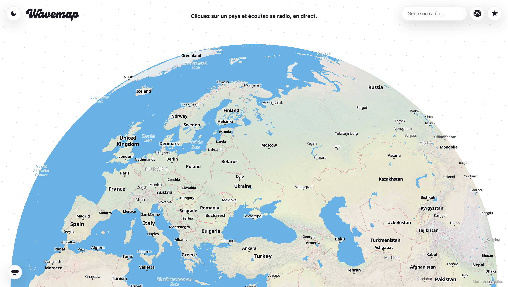
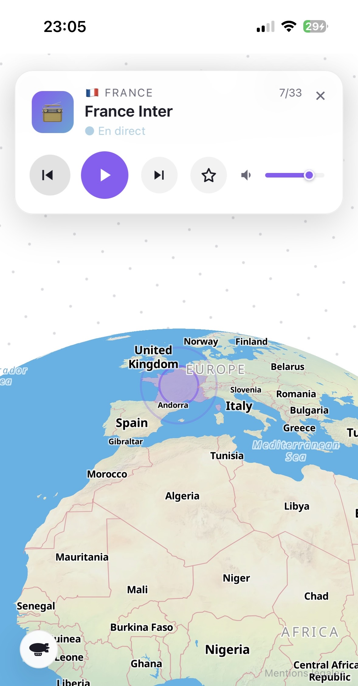
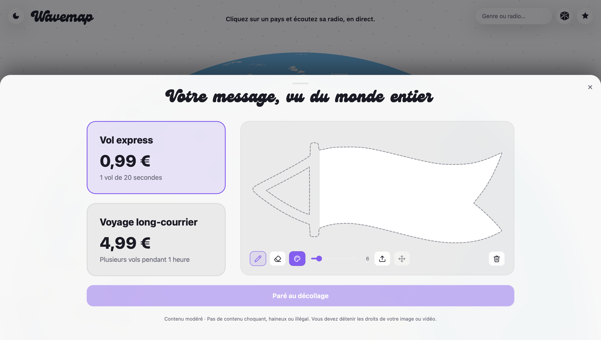

# Wavemap 🌍📻

**Cliquez sur un pays, écoutez sa radio en direct.**

Wavemap est un globe interactif qui vous connecte aux stations de radio du monde entier. Explorez la carte, découvrez de nouvelles sonorités, et envoyez votre message publicitaire à travers le ciel — visible par tous les visiteurs.

🔗 **[wavemap.net](https://wavemap.net)**

---

<p align="center">
  
</p>

<p align="center">
  
  
</p>

---

## Fonctionnalités

- **Radio en direct** — Cliquez sur n'importe quel pays pour écouter une station locale en streaming
- **Globe 3D** — Navigation fluide sur un globe MapLibre avec projection sphérique
- **Recherche** — Trouvez un pays ou un genre musical instantanément
- **Pub dirigeable** — Créez votre message (dessin, image ou vidéo) et faites-le voler sur le globe, visible par tous les visiteurs en temps réel
- **Multilingue** — Interface disponible en 11 langues, détection automatique
- **Responsive** — Adapté desktop et mobile

## Stack technique

| Frontend | Backend | Services |
|----------|---------|----------|
| MapLibre GL | Node.js / Express | Stripe Checkout |
| HLS.js | multer | OpenAI Moderation |
| iro.js (color picker) | Volume persistant | Railway |
| Vanilla JS | — | Namecheap DNS |

## Démarrage local

```bash
git clone https://github.com/NathanTessot75/wavemap.git
cd wavemap
npm install
```

Créez un fichier `.env` :

```env
STRIPE_SECRET_KEY=sk_test_...
OPENAI_API_KEY=sk-...
STRIPE_WEBHOOK_SECRET=whsec_...
```

```bash
npm start
# → http://localhost:5173
```

## Licence

© 2026 Nathan Tessot — Tous droits réservés.
